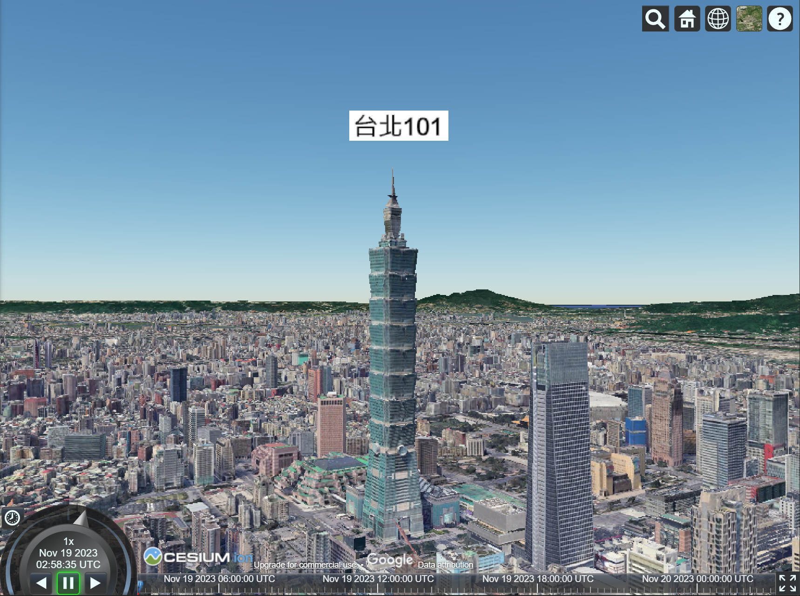
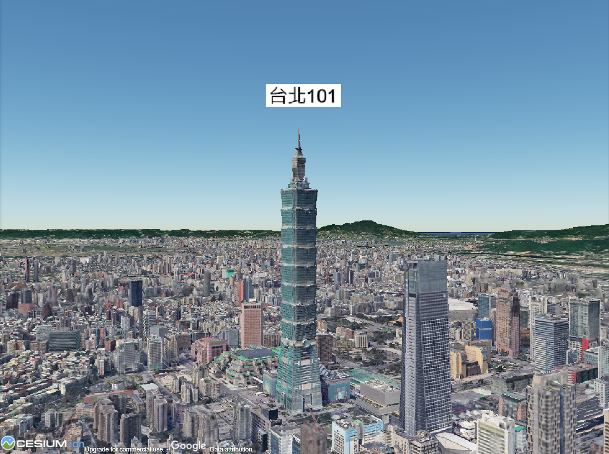

# 利用Cesium結合Vue3 + Vite

### [作品DEMO連結](https://jen-chun.github.io/cesium-vue/)

透過設定指定的座標，將視角固定在台北101的外觀與周圍的環境。

## 隱藏預設的介面

由於單純展示建物與周圍的場景不需要使用到預設介面，故將預設的按鈕與羅盤隱藏起來。

比較如下圖

 
 

## 初探Cesium與設計思路

截至目前為止，這是我第一次接觸到這個函式庫，因此我決定以類似建商角度出發，我的思考方式是以「如果建商要在3D地圖上展示自己的建案，該怎麼做」的角度去思考

第一、建商一定不會希望使用者擅自移動鏡頭，將地圖變成Google地球的形式把玩，基於這個理由，我先將預設介面隱藏起來避免使用者移動到別的座標。

第二、建商一定希望渲染的時候，立刻移動要指定的角度與指定的位置，所以我在渲染之後立刻使用lookAt()鎖定特定的座標，鏡頭也會以該位置為中心點旋轉。

## 加入 3D tileset

由於想展示台北101與其周邊的景觀，因此必須找出能夠將地形與建築3D化的建模，在詳閱官方教學後，找到了內建的"Google Photorealistic 3D Tiles"，利用 viewer.scene.primitives.add(await Cesium3DTileset.fromIonAssetId(2275207))將其渲染至畫面上。

## 加入建物標籤

雖然鏡頭與角度皆鎖定在指定的位置，但是為了讓使用者能夠更清楚的判斷出建物以及熟悉其名稱，因此採用entities.add方法在建物上方建立了一個標籤以標示其名稱。
